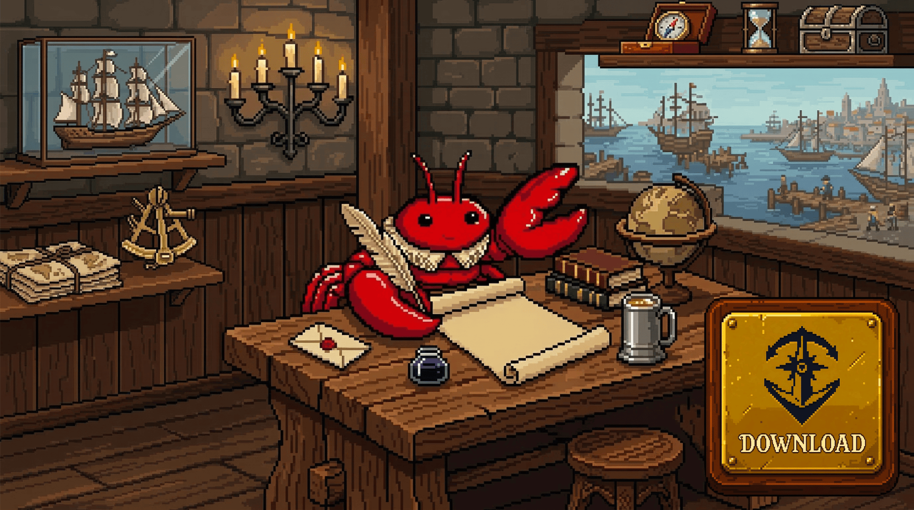
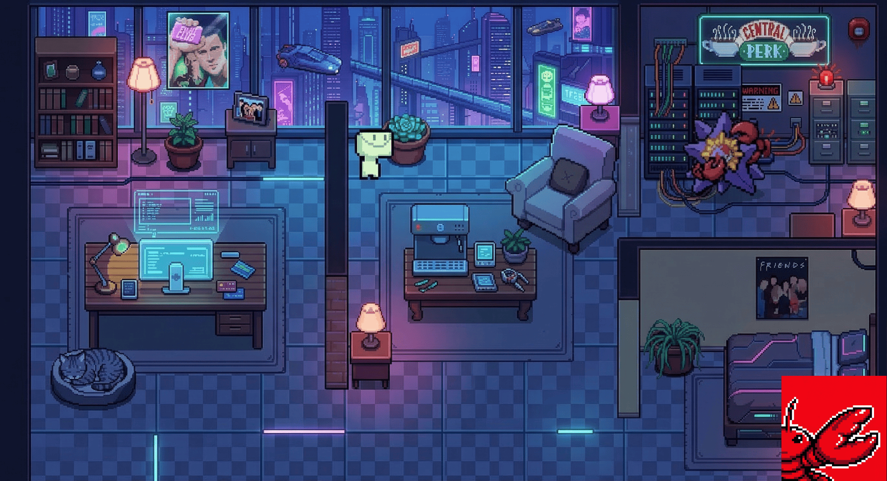

# 🦞 OpenClaw Office 🦞

**OpenClaw Office** is a desktop application that combines the powerful AI agent management dashboard functionality from [openclaw-manager](https://github.com/miaoxworld/openclaw-manager) with an interactive, real-time 3D visualization of their work.

Forget about boring terminal logs. Now your agents "live" in a virtual space, physically move between tasks, communicate, and consume resources under your complete visual control.

<div align="center">
  <a href="../../releases/latest">
    
  </a>
</div>

---

## ✨ Key Features

### 🎨 1. Dynamic Visual Spaces (Themes)

AI work is visualized in an interactive isometric environment rendered in real-time. Switch location styles with one click:

* 🏰 **Medieval:** Agents as knights and mages reading scrolls by the campfire or forging code in a smithy.
* 🏙 **Modern Metropolis:** Sleek offices with panoramic windows or high-tech coworking spaces.
* 🦾 **Cyberpunk:** Neon slums, holograms, hacker terminals, and server racks of the future.

<div align="center">
  <a href="../../releases/latest">
    
  </a>
</div>

### 📊 2. Advanced Dashboard and Two-Way Control

All agent management tools are gathered in a single panel. Thanks to our bidirectional WebSocket architecture, you can both monitor and control your agents:

* **Real-Time Control:** Pause execution, edit prompts on the fly, switch LLM models (OpenAI, Anthropic, or local via **Ollama / vLLM**), and manage API keys directly from the UI.
* **Token Monitoring:** Real-time token consumption and cost (in USD) charts for each individual agent.
* **Immutable Audit Log:** Strict logging of all agent actions (prompts, responses, errors) with full-text search and filtering.

### 🏃 3. Visualization of Base States

Agent avatars react to status changes pushed via the WebSocket bridge and perform the corresponding animations:

* `idle` — resting (drinking coffee / sitting by the fire).
* `researching` — fetching data (walking to cabinets / servers).
* `writing` — generating content/code (actively typing).
* `executing` — calling external tools, APIs, or scripts.
* `syncing` — exchanging data with other agents in a swarm.
* `error` — signaling a failure (red alert, breakdown animation).

### 💬 4. Floating Logs

Instead of reading a wall of text in the console, speech bubbles pop up above characters with summarized logs: *"Googling information..."*, *"Found 5 matches"*, *"Writing a Python script"*.

---

## 💻 System Requirements

To ensure smooth 3D rendering and real-time WebSocket communication:

* **OS:** Windows 10/11 (64-bit), macOS 11.0+ (Intel or Apple Silicon), Ubuntu 20.04+ (or equivalent Linux).
* **RAM:** 4 GB minimum (8 GB recommended).
* **GPU:** Any WebGL 2.0 compatible dedicated or integrated graphics card.
* **Network:** Open local port `19000` for the WebSocket bridge.

---

## 📦 Installation

1. Go to the [Releases](../../releases).
2. Download the installer for your OS:

* **Windows:** Download and run `OpenClaw-Office_x64.exe`.
* **macOS:** Download `OpenClaw-Office_macOS.dmg` and drag the application into the *Applications* folder.
* **Linux:** Download the `OpenClaw-Office.AppImage`, make it executable (`chmod +x OpenClaw-Office.AppImage`), and run it.

---

## 🚀 Quick Start

1. Launch **OpenClaw Office**.
2. Go to **Settings** -> **Integrations** and click **"Link Local Project"** to generate a secure **Bridge API Key**.
3. Install the bridge plugin in your existing OpenClaw agent project (see Integration below).
4. Start your agent. It will instantly appear in the isometric office space!

---

## 🔌 Integration & Setup

OpenClaw Office uses a **bidirectional WebSocket connection**. The Agent acts as the *Client* and connects to the Office *Server* (running locally on port `19000`). This allows the agent to stream telemetry (logs, states) while simultaneously allowing the dashboard to send control commands (stop, update prompt, push API keys) back to the agent, even if the agent is behind a NAT.

### Option A: Local Agents (Host Machine)

If your agents run locally on the same machine as OpenClaw Office:

1. Install the official bridge plugin in your agent's project directory:

```bash
# If using Node.js (v18+)
npm install @openclaw/office-bridge

# If using Python (3.8+)
pip install openclaw-office-bridge

```

2. In OpenClaw Office (Settings -> Integrations), click **"Link Local Project"** to generate a secure **Bridge API Key**.
3. Add the following to your agent's `.env` file *(and ensure `.env` is added to your `.gitignore` to keep keys safe!)*:

```env
OPENCLAW_OFFICE_URL=ws://127.0.0.1:19000
OPENCLAW_OFFICE_API_KEY=your_generated_secure_key_here

```

4. Start your agent. It will instantly appear in the isometric office space!

### Option B: Local Agents (Docker)

If your local agents run inside a Docker container, using `127.0.0.1` will point to the container itself, not your host machine where OpenClaw Office is running.

1. Install the bridge plugin in your containerized environment.
2. Generate your Bridge API Key in the OpenClaw Office UI.
3. Update your `.env` to use the Docker host DNS:

```env
# For Windows/macOS Docker Desktop users
OPENCLAW_OFFICE_URL=ws://host.docker.internal:19000
OPENCLAW_OFFICE_API_KEY=your_generated_secure_key_here

# Note: On Linux, you may need to use your machine's local LAN IP (e.g., 192.168.x.x) instead.

```

### Option C: Remote / Cloud Agents (VPS, ngrok)

If your agents run on a remote server, you need to securely expose the OpenClaw Office WebSocket port.

1. Expose your local port `19000` using a secure tunnel (e.g., `ngrok`, `Cloudflare Tunnels`):

```bash
ngrok http 19000

```

*(Note: Ensure you are forwarding standard TCP/HTTP traffic to allow WebSockets — `ws://` upgrades to `wss://`)*

2. Add the secure public URL and your generated API key to the remote project's `.env` file:

```env
OPENCLAW_OFFICE_URL=wss://<your-ngrok-domain>.ngrok-free.app
OPENCLAW_OFFICE_API_KEY=your_generated_secure_key_here

```

---

## 📄 License

This project is licensed under the MIT License. See the [LICENSE](../LICENSE) file for details.

---

**Made with ❤️ by OpenClaw Team**
